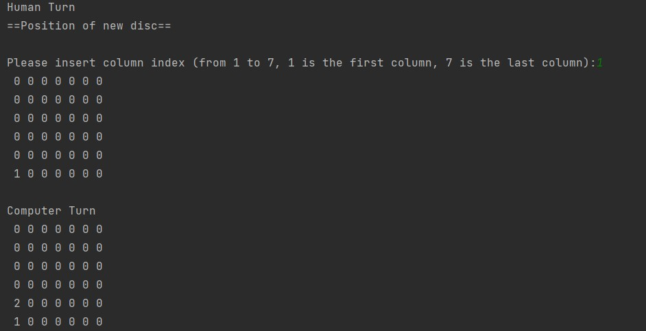
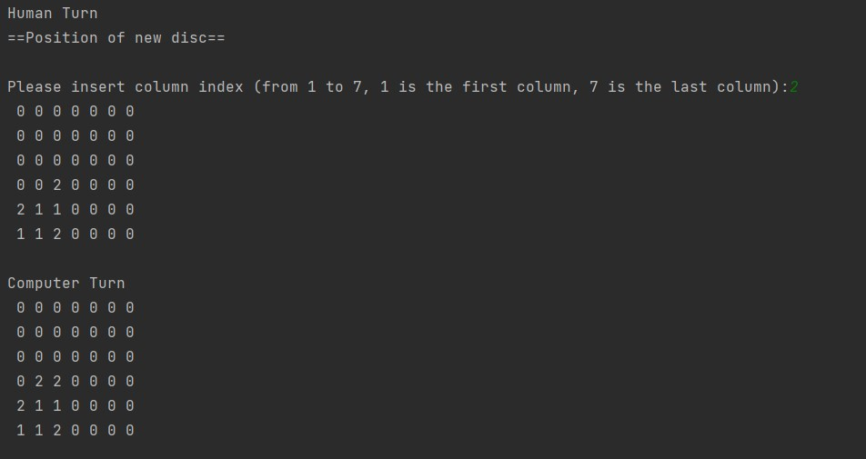
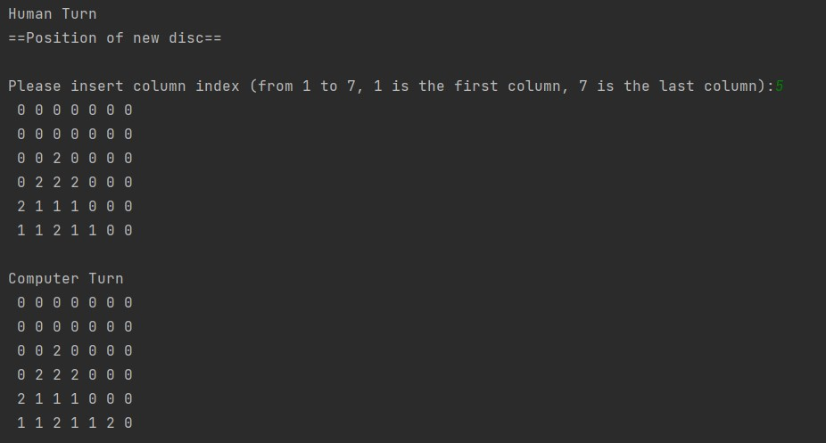
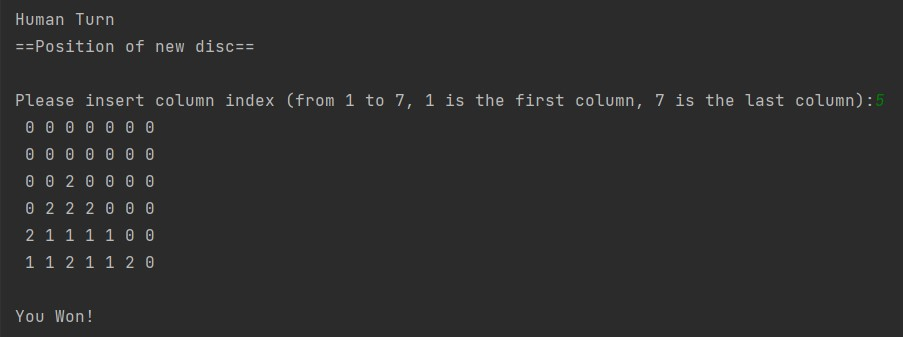

# Connect four

> 🕹️Connect Four game console-based implementation 🎲
---

### Table of Contents

- [Description](#description)
- [How To Use](#how-to-use)
---

## Description
Connect Four game console-based implementation, user plays againts the computer. The computer move to win the game whenever possible and block the human player’s attempts at 1-move victory.

#### Technologies

- Python
- Layered Arhitecture

[Back To The Top](#connect-four)

---

## How To Use

- User inputs the column where he wants to move. Few gameplay screenshots:  

[Back To The Top](#connect-four)

