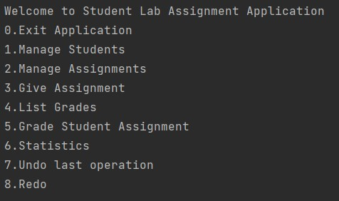
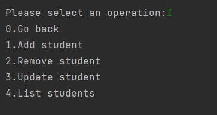
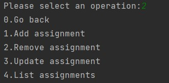
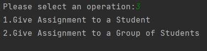
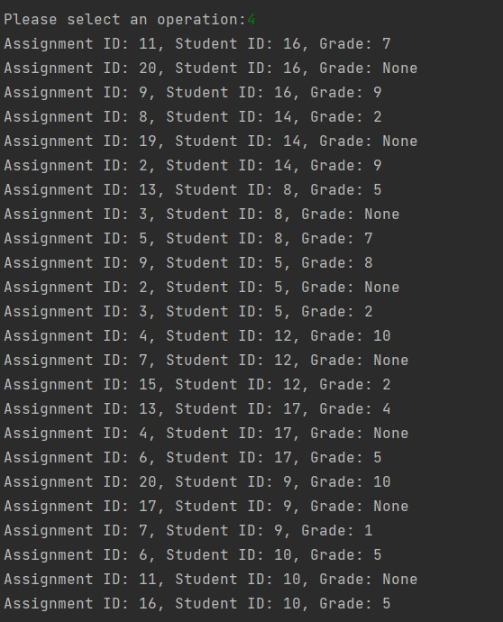
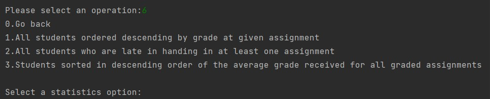

# Student Lab Assignment

> An application that manages student lab assignments for a discipline.

---

### Table of Contents

- [Description](#description)
- [How To Use](#how-to-use)
---

## Description

### 💻 Student Lab Assignment 💻
This is an application that manages student lab assignments for a discipline. The application will store:
- **Student**: `student_id`, `name`, `group`
- **Assignment**: `assignment_id`, `description`, `deadline`
- **Grade**: `assignment_id`, `student_id`, `grade_value`
### User can perform the following operations :
- The user can add, remove, update, and list both students and assignments.
- The user can give assignments to a student or a group of students. In case an assignment is given to a group of students, every student in the group will receive it. In case there are students who were previously given that assignment, it will not be assigned again.
- Also grade student for a given assignment. When grading, the program must allow the user to select the assignment that is graded, from the student’s list of ungraded assignments. A student’s grade for a given assignment cannot be changed. Deleting a student removes their assignments. Deleting an assignment also removes all grades at that assignment.
 - User is able to see statistics:
    - All students who received a given assignment, ordered descending by grade.
    - All students who are late in handing in at least one assignment. These are all the students who have an ungraded assignment for which the deadline has passed.
    - Students with the best school situation, sorted in descending order of the average grade received for all graded assignments.
  Unlimited undo/redo functionality. Each step will undo/redo the previous operation performed by the user. Undo/redo operations have a memory-efficient implementation.
- Also, the storage is persistent, user can configure settings.properties and choose between text files and binary files.
#### Technologies

- Python
- Layered Arhitecture

[Back To The Top](#student-lab-assignment)

---

## How To Use

The application provides a menu-driven console-based user interface. For each action there is an integer associated and the user will interact with the console.

- Main menu :
 
  
- Manage students :

  
- Manage assignments :
  
  
- Give assignments :
  
  
  
- List all the grades :
  
  
 
 - See the statistics :
  
   
 
[Back To The Top](#student-lab-assignment)

---
