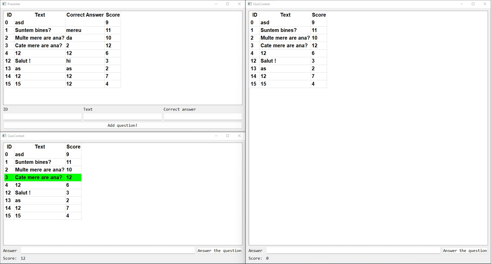

# Quiz contest

Write an application which simulates a quiz, as follows:
1. The information about the questions is in a text file. Each Question has an id (int), a text (string), the
correct answer (string) and a score (int). These are read when the application starts and are also stored
in the file by the program,
2. Another file contains information about the participants, Each Participant has a name (string) and a
score (int). This file is manually created and it is read when the application starts. The initial score is 0
for each participant.
3. When the application is launched, a new window is created for the presenter (with the title
"Presenter") and also one for each participant, having as title the participant's name. (0.5p)
4. The window of the presenter will show all the questions, with their id, text, correct answer and
associated score, sorted by id.
5. The windows of the participants will show all the questions, with their id, text and associated score,
sorted descending by score. 
6. Only the presenter can add questions, by inputting the question's id, text and correct answer and
pressing a button "Add*. This operation falls if the text is empty or if there is another question with
the same id. The user will be informed if the operation fails.
7. The participants can answer questions, by selecting the question, inputting the answer in a text edit
and pressing a button "Answer*:  A participant cannot answer the same question twice. When a question is answered, it will
have a green background in the participant's list and when clicking it, the Answer" button
will be disabled. 
The score of each participant is shown in his/her window. When a question was answered
correctly, the score of the participant increases by the score of the question that was
answered. 
8. When a modification is made by the presenter, all the participants will see the modified list of
questions.
9. When the application is finished, the questions file will be updated.
<h2>A little preview : </h2>

