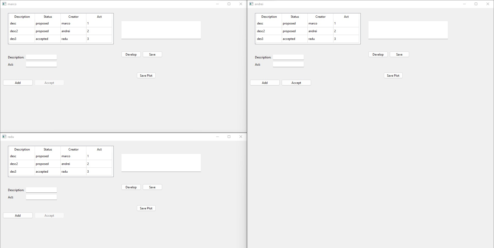

# Screen Writing

Write an application which simulates the writing of a television episode by professional screenwriters, as
follows:
1. The information about the screenwriters working on the episode is in a text file. Each writer has a name
(string) and his/her expertise - can be Assistant, Junior or Senior (string). This file is manually created and
it is read when the application starts.
2. Another file contains information about the ideas that were proposed by the writers. Each Idea has a
description, a status (can be proposed or accepted), the creator - the name of the writer who created it
and the act - the act it belongs to in the narrative (it can only be 1, 2 or 3). These are read when the
application starts.
3. When the application is launched, a new window is created for each writer, having as title the writer's
name. The window will show all the ideas launched so far (description, status, creator, and act), sorted
by act. This will be shown in a QTableView. 
4.Any writer can add a new idea, by inputting the idea's description and act. The idea's creator will
automatically be the name of the writer who added it and the status will be proposed. This operation fails
if the description is empty, if the act is not 1, 2 or 3 or if there is another idea with the same description
in the same act.
5. Senior writers can revise ideas and accept them. This will be possible only if the status of selected idea is
proposed. When an idea is accepted, its status changes to accepted.
6. When a modification is made by any writer, all the other writers will see the modified list of ideas. The
score for this functionality is given only if you are using the Qt Model/View architecture, 
7. Each writer has the possibility to further develop his accepted ideas. A button "Develop" will be available
only to the writers having accepted ideas. When this button is clicked, each accepted idea will be shown
separately in a new QTextEdit and a new "Save" button will be available for each accepted idea. The writer
can develop each accepted idea in its own text edit and then save it to a file. 
8. Each writer has a button "Save plot", which will save to a file the entire plot of the episode: this will
contain only the accepted ideas (description), their writers (in brackets) and will be created by acts (E.g.
Act 1 - all ideas from act 1, on separate lines; Act 2 - the same; Act 3 - the same).
<h2>A little preview : </h2>

