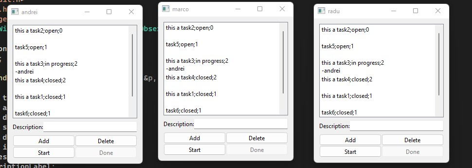

# Task Manager

Write an application which simulates the development of a software application, as follows:
1. The information about the development team is in a text file. Each Programmer has a name (string)
and an id (integer). This file is manually created and it is read when the application starts.
2. Another file contains information about the tasks. Each Task has a description (string), a status (can
be open, in progress or closed) and the id of the programmer that is working/has worked on the task,
if the task is in progress or closed. These are stored in the file by the program.
3. When the application is launched, a new window is created for each programmer, having as title the
programmer's name.
4. Each window will show all the tasks, with their description and status, sorted by status.
5. A programmer can add a task. When a task is added, its status will be open, by default.
6. A programmer can remove a task. 
7. When a programmer starts working on a task having the open status, he/she selects the task and
presses a button "Start". The task changes its state to in progress and the name of the programmer
will be shown next to the task. This operation fails if the selected task is not open and the programmer
is informed.
8. A programmer can close a task in progress by clicking a button "Done". The button will be enabled
only if the task is in progress and if the programmer is the same one that started to work on the task.
9. When a modification is made by any programmer, all the other programmers will see the modified
list of tasks.
10. When the application is finished, the tasks file will be updated.
<h2>A little preview:</h2>

