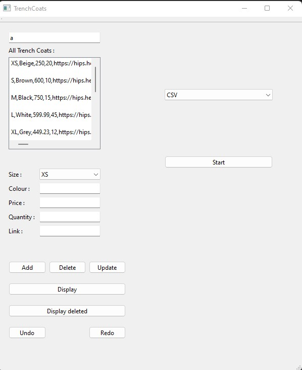
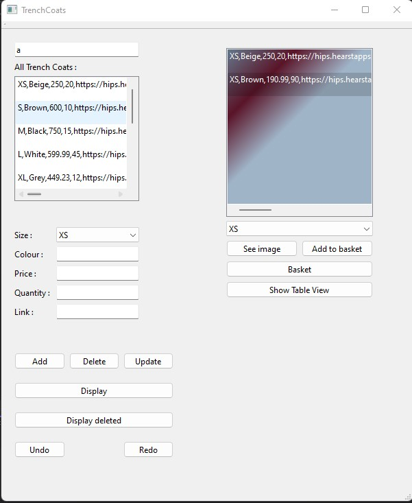
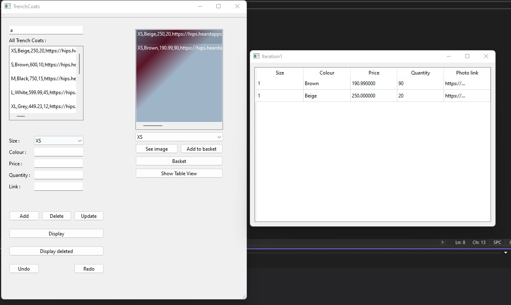

# Trench coats

Trench coats are cool. Everyone should own a trench coat. The “Proper Trench Coats” store sells
fashionable, elegant trench coats and the store needs a software to allow their customers to “order
online”. The application can be used in two modes: administrator and user. When the application is
started, it will offer the option to choose the mode.

*Administrator mode:* The application will have a database4
, which holds all the available trench coats at
a given moment. The store employees must be able to update the database, meaning: add a new trench
coat, delete a trench coat (when it is sold out) and update the information of a trench coat. Each Trench
Coat has a size, a colour, a price, a quantity and a photograph. The photograph is memorised as a link
towards an online resource (the photograph on the presentation site of the store). The administrators
will also have the option to see all the trench coats in the store.

*User mode:* A user can access the application and choose one or more trench coats to buy. The
application will allow the user to:

a. See the trench coats in the database, having a given size, one by one. If the size is empty, then
all the trench coats will be considered. When the user chooses this option, the data of the first
trench coat (size, colour, price, quantity) is displayed, along with its photograph.

b. Choose to add the trench to the shopping basket. In this case, the price is added to the total sum
the user has to pay. The total sum will be shown after each purchase.

c. Choose not to add the trench coat to the basket and to continue to the next. In this case, the
information corresponding to the next trench coat is shown and the user is again offered the
possibility to buy it. This can continue as long as the user wants, as when arriving to the end of
the list, if the user chooses next, the application will again show the first trench coat.

d. See the shopping basket and the total price of the items.

Store your data in a text file. When the program starts, the entities in the database (file) will be
read. The modifications made during the execution of the application should be stored in the file.
For this feature, use the iostream library. Create insertion and extraction operators for your
entities and use these when reading/writing to files or console.

Use exceptions to signal errors:
- from the repository;
- validation errors – validate your entities using Validator classes;
- create your own exception classes.
Validate your input data.

Store your shopping basket in a file. When the application starts, the user should choose the type of file (CSV or HTML).
Depending on this type, the application should save the list in the correct format. 

Add a multiple undo and redo functionality for the operations “add”, “remove”, “update” in
your repository. Implement this functionality using inheritance and polymorphism. You will
have a “Undo” and “Redo” buttons on your GUI, as well as a key combination to undo and
redo the operations (e.g. Ctrl+Z, Ctrl+Y).

Create a new window which presents the contents of your:

- shopping basket

This window will contain a list view/table view with all the elements in your list. You must use Qt
View/Model components (QTableView). Create your own model – a class which inherits from
QAbstractListModel or QAbstractTableModel.
This window will be opened from your GUI main window

<h2>A little preview:</h2>

<h2>User Mode:</h2>

<h2>Table view:</h2>

